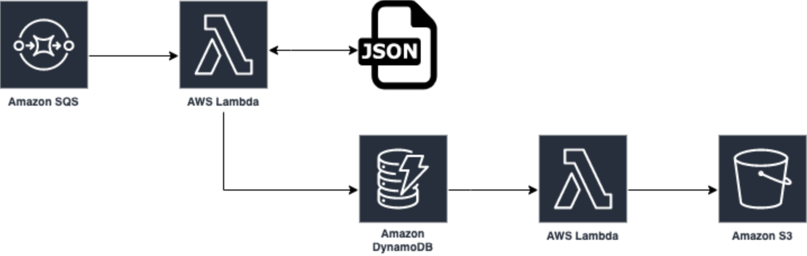

# Lambda-Tracing-Comparison
This repo is designed to compare tracing tools for lambda functions.\
This repo currently supports
 * aws-xray (src/functions/aws-xray)
 * lumigo (src/functions/lumigo)

 ### Tech stack
Packaging and Deployment - Serverless Framework\
Function Code - NodeJs Typescript\
Unit Tests - Jest

### Stack Deployment
Have an AWS credential provider set up in your CLI\
Run `sls deploy`

### Stack Removal
Have an AWS credential provider set up in your CLI\
```
STACK_NAME=$(sls info | grep stack | sed 's/[^ ]* //')
S3_BUCKET=$(aws cloudformation describe-stack-resources --stack-name ${STACK_NAME} --query 'StackResources[?LogicalResourceId==`S3Bucket`].PhysicalResourceId' --output text)
aws s3 rm s3://${S3_BUCKET}/ --recursive
sls remove
```
### Trigger functions
Run send-sqs.sh with first input being the number of messages e.g. the following will send 100 messages to the sqs queues\
`./send-sqs.sh 100`

### Sequence Diagram
